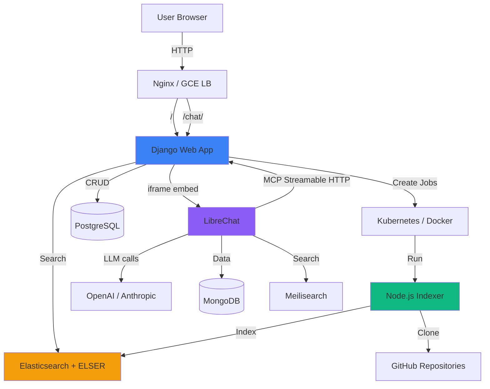
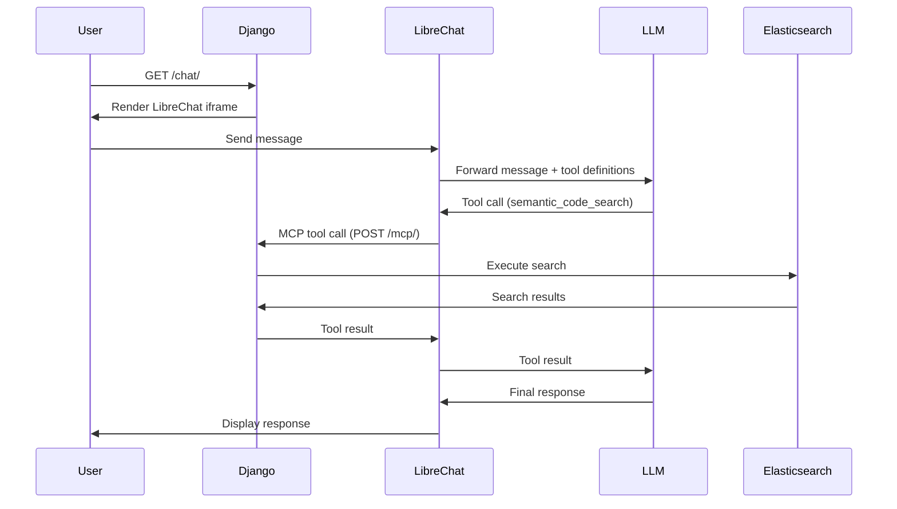
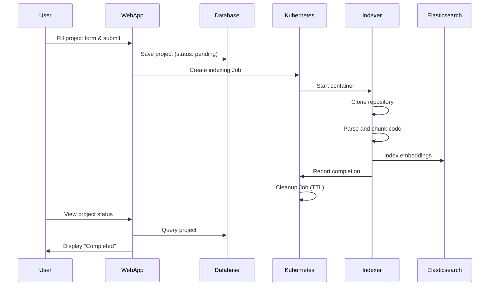
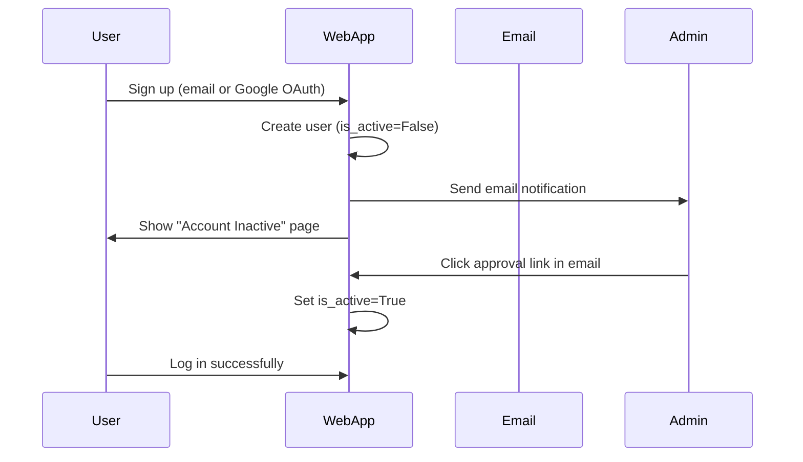

# CodePathfinder Project Documentation

**Author:** Tom Grabowski
**Version:** 2.0
**Last Updated:** March 2026

---

## Table of Contents

1. [Project Overview](#project-overview)
2. [Architecture](#architecture)
3. [Components](#components)
4. [Technology Stack](#technology-stack)
5. [Project Structure](#project-structure)
6. [Key Features](#key-features)
7. [Workflows](#workflows)
8. [API Reference](#api-reference)
9. [MCP Server](#mcp-server)
10. [Database Schema](#database-schema)
11. [Deployment](#deployment)
12. [Examples](#examples)
13. [Development Guide](#development-guide)

---

## Project Overview

**CodePathfinder** is a semantic code indexing, search, and AI-powered chat platform. It combines a Django web application, a Node.js indexer service, and a LibreChat-based AI interface to make large codebases navigable, searchable, and conversational.

### Purpose

CodePathfinder enables developers to:
- **Index entire code repositories** using semantic search technology
- **Search code by intent** rather than exact keywords
- **Chat with their codebase** via an AI assistant with access to 21 MCP tools
- **Manage GitHub operations** (issues, PRs, branches) through AI or API
- **Track indexing jobs** via Kubernetes-based job management
- **Manage multiple projects** through a modern web interface

### Key Capabilities

- Semantic code search powered by Elasticsearch ELSER
- Multi-language support (TypeScript, JavaScript, Python, Java, C++, Go, Rust, etc.)
- AI chat interface via LibreChat with multi-model support (GPT-5, Claude Sonnet 4)
- MCP server with 21 tools (code search, GitHub, skills, jobs)
- GitHub repository integration with private repo support
- Real-time job monitoring and management
- User authentication (email + Google OAuth) with admin approval workflow
- Project-scoped API keys for external integrations
- OAuth2 support for Claude Desktop and other MCP clients

---

## Architecture

CodePathfinder follows a **microservices architecture** with LibreChat handling all AI/LLM interactions and Django serving as the platform backend and MCP server.



### Architecture Components

1. **Web Application Layer (Django)**
   - User authentication and authorization (email + Google OAuth)
   - Project management interface
   - MCP server (Streamable HTTP + legacy SSE)
   - Job orchestration via Kubernetes API or Docker
   - API key management and OAuth2 provider

2. **Chat Layer (LibreChat)**
   - AI chat interface embedded via iframe at `/chat/`
   - Multi-model support: GPT-5, GPT-5 Mini, GPT-5.2, Claude Sonnet 4, Claude 3.5 Haiku
   - Connects to Django exclusively via MCP for tool access
   - LLM configuration managed in `chat-config/librechat.yaml`

3. **Indexer Service Layer (Node.js)**
   - Tree-sitter based code parsing
   - Semantic chunking algorithms
   - Elasticsearch ELSER indexing

4. **Data Layer**
   - PostgreSQL for application data (Cloud SQL in prod)
   - Elasticsearch for semantic search (Elastic Cloud in prod)
   - MongoDB for LibreChat data
   - Meilisearch for LibreChat search

5. **Orchestration Layer**
   - Kubernetes (GKE) for production job scheduling
   - Docker for local development job execution
   - CronJob for periodic job status checks

---

## Components

### 1. Web Application (`web/`)

**Purpose:** Platform backend — user management, project management, MCP server, and job orchestration.

**Key Modules:**

- **`core`** — User authentication, registration, admin user management, admin settings
- **`projects`** — Project CRUD, job triggering, status tracking, API key management, sharing
- **`chat`** — LibreChat iframe embed, conversation export, artifact sharing
- **`mcp_server`** — MCP server with 21 tools (streamable HTTP + legacy SSE), OAuth2 dashboard
- **`templates`** — Django templates for UI rendering
- **`static`** — CSS, JavaScript, and static assets

**Key Files:**

- `CodePathfinder/settings.py` — Django configuration
- `core/views.py` — User management, admin settings, beta approval
- `projects/views.py` — Project CRUD, job actions, API keys, index stats
- `projects/utils.py` — Kubernetes/Docker job management
- `chat/views.py` — LibreChat embed view, conversation management
- `mcp_server/streamable.py` — Primary MCP endpoint (`/mcp/`)
- `mcp_server/tools.py` — 21 tool definitions and handlers
- `mcp_server/views.py` — Legacy SSE endpoint, OAuth2 dashboard

### 2. LibreChat (`chat/`, `chat-config/`)

**Purpose:** AI chat interface with multi-model support. Connects to CodePathfinder via MCP.

**Key Files:**

- `chat/Dockerfile` — LibreChat Docker image
- `chat-config/librechat.yaml` — Model configuration, MCP server connection, model presets

**LLM Models:**
- OpenAI: GPT-5, GPT-5 Mini, GPT-5.2
- Anthropic: Claude Sonnet 4, Claude 3.5 Haiku

**MCP Connection:**
- Local: `http://web:8000/mcp/` (via shared Docker network `cpf-librechat`)
- Production: `http://codepathfinder-service.codepathfinder.svc.cluster.local/mcp/` (via K8s cluster DNS)
- Auth: Bearer token using `CPF_INTERNAL_SERVICE_SECRET`

### 3. Indexer Service (`indexer/`)

**Purpose:** Clones repositories, parses code, and indexes it into Elasticsearch.

**Key Features:**

- **Language Support:** TypeScript, JavaScript, Python, Java, C++, Go, Rust, Ruby, PHP, C#, Swift
- **Chunking Strategies:**
  - Function-level chunking for structured languages
  - Sliding window chunking for unstructured content
- **Embedding Generation:** Using Elasticsearch ELSER inference endpoints
- **Incremental Indexing:** Support for watching and re-indexing changes

### 4. Kubernetes Integration

**Purpose:** Manages indexing jobs as Kubernetes Jobs (prod) or Docker containers (local).

**Production Configuration:**
- Namespace: `codepathfinder` (web app), `code-pathfinder` (indexer jobs)
- CronJob: `check-job-status` every 5 minutes
- Cloud SQL Proxy sidecar for database access
- Cross-namespace RBAC for job management

**Local Configuration:**
- Jobs run as Docker containers mounting the Docker socket
- Status tracked via Django's `JobRun` model

---

## Technology Stack

### Backend
- **Django 4.2** — Web framework
- **Python 3.9** — Programming language
- **PostgreSQL 15** — Application database (Cloud SQL in production)
- **gunicorn** — WSGI server (2 workers, 4 threads)

### Chat
- **LibreChat** — AI chat interface
- **OpenAI API** — GPT-5, GPT-5 Mini, GPT-5.2
- **Anthropic API** — Claude Sonnet 4, Claude 3.5 Haiku

### Frontend
- **HTML5/CSS3** — Markup and styling
- **JavaScript (Vanilla)** — Client-side interactivity
- **Custom CSS Framework** — Modern, gradient-based design

### Indexer
- **Node.js 20** — Runtime environment
- **TypeScript** — Programming language
- **Tree-sitter** — Code parsing
- **@elastic/elasticsearch** — Search client

### Infrastructure
- **Docker / Docker Compose** — Containerization and local development
- **Kubernetes (GKE)** — Production orchestration
- **Elasticsearch 9.x** — Semantic search with ELSER
- **MongoDB** — LibreChat data storage
- **Meilisearch** — LibreChat search
- **Nginx** — Local development reverse proxy
- **GCE Load Balancer** — Production (no nginx in prod)

---

## Project Structure

```
pathfinder/
├── web/                          # Django web application
│   ├── CodePathfinder/           # Django project settings
│   ├── core/                     # User auth, admin, settings
│   │   ├── models.py             # User model, AdminSettings
│   │   ├── views.py              # Auth, admin, beta approval
│   │   └── urls.py               # URL routing
│   ├── projects/                 # Project management
│   │   ├── models.py             # PathfinderProject, JobRun
│   │   ├── views.py              # Project CRUD, API keys, jobs
│   │   ├── utils.py              # K8s/Docker job management
│   │   └── urls.py               # URL routing
│   ├── chat/                     # Chat integration
│   │   ├── views.py              # LibreChat embed, conversations
│   │   └── urls.py               # URL routing
│   ├── mcp_server/               # MCP server
│   │   ├── streamable.py         # Streamable HTTP endpoint
│   │   ├── views.py              # Legacy SSE, OAuth dashboard
│   │   └── tools.py              # 21 tool definitions
│   ├── templates/                # HTML templates
│   ├── static/                   # CSS, JS, assets
│   ├── manage.py                 # Django management
│   └── requirements.txt          # Python dependencies
├── indexer/                      # Node.js indexer service
│   ├── src/                      # TypeScript source
│   │   ├── index.ts              # Main entry point
│   │   ├── chunker/              # Code chunking
│   │   ├── embedder/             # Embedding generation
│   │   └── queue/                # Processing queue
│   ├── package.json              # Node dependencies
│   ├── Dockerfile                # Container definition
│   └── .env                      # Environment variables
├── chat/                         # LibreChat
│   └── Dockerfile                # LibreChat image
├── chat-config/
│   └── librechat.yaml            # LibreChat configuration
├── kubernetes/                   # K8s manifests
│   ├── deployment.yaml           # Web app deployment
│   ├── ingress.yaml              # Ingress + SSL
│   ├── cronjob-status-checker.yaml
│   └── librechat/                # LibreChat K8s manifests
│       ├── librechat-deployment.yaml
│       ├── librechat-ingress.yaml
│       ├── mongodb-statefulset.yaml
│       └── meilisearch-deployment.yaml
├── scripts/
│   ├── deploy.sh                 # GCP deployment script
│   └── smoke_test.py             # Smoke test suite
├── tests/                        # Test suite
│   └── smoke/                    # Smoke tests
├── nginx/
│   └── conf.d/default.conf       # Nginx config (local)
├── docker-compose.yml            # Local development stack
├── Dockerfile.prod               # Production web image
├── pytest.ini                    # Test configuration
└── docs/                         # Documentation
```

---

## Key Features

### 1. User Management

**Authentication:**
- Google OAuth 2.0 integration
- Email/password registration
- Default inactive state for new registrations
- Admin approval workflow via email notifications
- Beta signup with one-click approval link

**Authorization:**
- Regular users can manage their own projects
- Superuser access to all projects and user management
- Project sharing between users
- Project isolation per user

**Admin Features:**
- User list with filtering
- Edit user details (username, email, permissions)
- Delete users with cascade deletion of projects
- Enable/disable user accounts
- Admin settings panel for site configuration

### 2. Project Management

**Create Projects:**
- Repository URL input
- Optional GitHub token for private repos
- Branch selection
- Custom index names
- Indexing options (clean, pull, watch mode)
- Concurrency settings

**Manage Projects:**
- List all projects with status indicators
- Start/stop/reset indexing jobs
- Clone existing projects
- Share projects with other users
- Generate per-project API keys
- View Elasticsearch index statistics

**Status Tracking:**
- Pending, Running, Completed, Failed, Watching, Stopped
- Real-time status polling
- Job logs viewer (Kubernetes or Docker)

**Project Visibility:**
- Projects feature a manual "Enabled" toggle
- When **Enabled**, projects are searchable via Chat and MCP tools
- When **Disabled**, projects are hidden from search but indexing data is preserved

### 3. AI Chat (LibreChat)

Chat functionality is provided by LibreChat, embedded in the Django app at `/chat/`.

**Features:**
- Multi-model AI chat (GPT-5, Claude Sonnet 4, etc.)
- All 21 CodePathfinder MCP tools available to the AI
- Conversation history (stored in MongoDB)
- Artifact creation and sharing
- Model presets with pre-configured tool access

**Architecture:**
- Django serves an iframe embedding LibreChat
- LibreChat connects to Django via MCP at `http://web:8000/mcp/` (local) or cluster DNS (prod)
- Auth: Internal service secret shared between LibreChat and Django
- LLM configuration lives in `chat-config/librechat.yaml`, not in the database

### 4. MCP Server (21 Tools)

The MCP server implements the **MCP 2025-06-18 Streamable HTTP** specification at `/mcp/`.

**Code Search Tools (6):**
| Tool | Description |
|------|-------------|
| `semantic_code_search` | Search code using natural language queries |
| `map_symbols_by_query` | Find functions, classes, methods matching a query |
| `symbol_analysis` | Analyze a symbol's definitions and references |
| `read_file_from_chunks` | Read a complete file from indexed chunks |
| `document_symbols` | List symbols that need documentation |
| `size` | Get statistics about the code index |

**GitHub Tools (7):**
| Tool | Description |
|------|-------------|
| `github_create_issue` | Create a GitHub issue |
| `github_get_labels` | Get repository labels |
| `github_add_comment` | Add a comment to an issue/PR |
| `github_create_pull_request` | Create a pull request |
| `github_create_branch` | Create a new branch |
| `github_list_branches` | List repository branches |
| `github_get_repo_info` | Get repository information |

**Skills Tools (6):**
| Tool | Description |
|------|-------------|
| `skills_list` | List available skills |
| `skills_get` | Get a specific skill |
| `skills_search` | Search for skills |
| `skills_sync` | Sync skills from source |
| `skills_import` | Import a skill |
| `skills_activate` | Activate/deactivate a skill |

**Job Management Tools (2):**
| Tool | Description |
|------|-------------|
| `job_manage` | Start/stop/reset indexing jobs |
| `job_status` | Get job status information |

**Authentication (in priority order):**
1. `CPF_INTERNAL_SERVICE_SECRET` → superuser `__internal_service__` user (LibreChat)
2. `cpf_`-prefixed Project API Keys → project owner user
3. OAuth2 `AccessToken` → token's user

**Legacy SSE Transport:**
Available at `/mcp/sse/` implementing MCP 2024-11-05 HTTP+SSE spec.

### 5. Semantic Code Indexing

**Supported File Types:**
TypeScript, TSX, JavaScript, JSX, Python, Java, C++, C, Go, Rust, Ruby, PHP, C#, Swift, and more.

**Chunking Strategies:**

1. **Function-Level Chunking** (for structured languages)
   - Extracts functions, methods, classes
   - Includes context from parent nodes
   - Preserves code structure

2. **Sliding Window Chunking** (for unstructured content)
   - Configurable window size and overlap
   - Handles documentation, configs, etc.

### 6. Kubernetes Job Management

**Job Lifecycle:**
1. User clicks "Run" on a project (or AI uses `job_manage` tool)
2. Web app creates Kubernetes Job (prod) or Docker container (local)
3. Indexer container clones repo, parses code, indexes to Elasticsearch
4. CronJob checks status every 5 minutes and updates Django database
5. Job is cleaned up after completion (TTL: 1 hour)

---

## Workflows

### Chat with Codebase



### Creating and Running a Project



### User Registration Flow



---

## API Reference

### Web Endpoints

| Method | Path | Description |
|--------|------|-------------|
| GET | `/` | Redirect to projects (auth) or login |
| GET | `/login/` | Login page (allauth) |
| POST | `/logout/` | Logout |
| GET/POST | `/register/` | Registration |
| GET | `/docs/` | Documentation |
| GET | `/about/` | About page |
| GET | `/beta/` | Beta signup |
| GET | `/beta/approve/<token>/` | One-click beta approval |

### Admin Endpoints

| Method | Path | Description |
|--------|------|-------------|
| GET | `/users/` | User list (superuser) |
| GET/POST | `/users/create/` | Create user |
| GET/POST | `/users/<pk>/edit/` | Edit user |
| POST | `/users/<pk>/delete/` | Delete user |
| GET/POST | `/settings/` | Admin settings (superuser) |

### Project Endpoints

| Method | Path | Description |
|--------|------|-------------|
| GET | `/projects/` | Project list |
| GET/POST | `/projects/create/` | Create project |
| POST | `/projects/<pk>/action/` | Run/stop/reset/enable/disable/delete |
| GET/POST | `/projects/edit/<pk>/` | Edit project |
| POST | `/projects/clone/<pk>/` | Clone project |
| GET/POST | `/projects/share/<pk>/` | Share project |
| GET/POST | `/projects/api-keys/<pk>/` | Manage API keys |
| GET | `/projects/job-logs/` | Job logs (JSON) |
| GET | `/projects/statuses/` | Project statuses (JSON) |
| GET | `/projects/<pk>/index-stats/` | Index statistics (JSON) |

### Chat Endpoints

| Method | Path | Description |
|--------|------|-------------|
| GET | `/chat/` | LibreChat embed (primary chat UI) |
| GET | `/chat/project/<id>/` | Legacy project-scoped chat |
| POST | `/chat/conversation/create/` | Create conversation |
| POST | `/chat/conversation/<id>/delete/` | Delete conversation |
| GET | `/chat/conversation/<id>/export/` | Export as Markdown |
| GET | `/chat/artifact/share/<token>/` | Public artifact sharing |

### MCP Endpoints

| Method | Path | Description |
|--------|------|-------------|
| GET/POST | `/mcp/` | MCP Streamable HTTP (primary) |
| GET | `/mcp/sse/` | MCP SSE stream (legacy) |
| POST | `/mcp/messages/` | MCP message handler (legacy) |
| GET/POST | `/mcp/dashboard/` | OAuth2 credentials management |

### Chat API (API Key Auth)

| Method | Path | Description |
|--------|------|-------------|
| GET | `/chat/api/conversations/` | List conversations |
| POST | `/chat/api/conversations/` | Create conversation |
| GET | `/chat/api/conversations/<id>/` | Get conversation |
| DELETE | `/chat/api/conversations/<id>/` | Delete conversation |

---

## MCP Server

### Streamable HTTP Transport (`/mcp/`)

The primary MCP endpoint implements the MCP 2025-06-18 Streamable HTTP spec.

**Features:**
- JSON-RPC methods: `initialize`, `tools/list`, `tools/call`, `resources/list`, `prompts/list`, `ping`
- SSE fallback via GET requests (with heartbeats)
- CORS: `Access-Control-Allow-Origin: *`
- Protocol version: `MCP-Protocol-Version: 2025-06-18`
- Session management via `Mcp-Session-Id` header

**Authentication:**
Three methods checked in order:
1. Internal service secret → superuser context
2. Project API key (`cpf_` prefix) → project owner context
3. OAuth2 access token → token user context

### Legacy SSE Transport (`/mcp/sse/` + `/mcp/messages/`)

Implements MCP 2024-11-05 HTTP+SSE spec using database-polling. Still functional as a fallback.

### OAuth2 Dashboard (`/mcp/dashboard/`)

Web UI for managing OAuth2 client credentials (client ID, secret, redirect URIs).

### Tool Definitions

All tools are defined in `web/mcp_server/tools.py` in the `TOOL_DEFINITIONS` list. Both MCP transports share this definition. To add a tool:

1. Add the definition to `TOOL_DEFINITIONS` in `tools.py`
2. Implement the handler function
3. Register it in the `TOOLS` dict
4. Deploy — clients will pick up the new tool on next connection

---

## Database Schema

### User Model (Core App)

Extends Django's `AbstractUser`:

```python
class User(AbstractUser):
    email = EmailField(unique=True)
    is_active = BooleanField(default=False)
```

### PathfinderProject Model

```python
class PathfinderProject(models.Model):
    user = ForeignKey(User, on_delete=CASCADE, related_name='projects')
    name = CharField(max_length=255)
    repository_url = URLField()
    status = CharField(choices=STATUS_CHOICES, default='pending')
    is_enabled = BooleanField(default=True)
    github_token = CharField(blank=True, null=True)
    branch = CharField(blank=True, null=True)
    custom_index_name = CharField(blank=True, null=True)
    clean_index = BooleanField(default=False)
    pull_before_index = BooleanField(default=False)
    watch_mode = BooleanField(default=False)
    concurrency = PositiveIntegerField(default=4)
    created_at = DateTimeField(auto_now_add=True)
```

### JobRun Model

```python
class JobRun(models.Model):
    project = ForeignKey(PathfinderProject, on_delete=CASCADE)
    job_name = CharField(max_length=255)
    status = CharField(choices=STATUS_CHOICES, default='pending')
    started_at = DateTimeField(auto_now_add=True)
    completed_at = DateTimeField(null=True, blank=True)
    error_message = TextField(blank=True)
```

### MCP Models

- `MCPSession` — Tracks MCP sessions (used by legacy SSE transport)
- `MCPMessageQueue` — Message queue for SSE polling
- `MCPClientCredentials` — OAuth2 client ID/secret pairs

### Chat Models (Legacy)

- `ChatConversation` — Conversation records (kept for export/backwards-compat)
- `ChatMessage` — Message records
- `ChatArtifact` — Shared artifacts with public tokens

**Note:** Active chat data is stored in LibreChat's MongoDB. Django chat models are retained for conversation export and artifact sharing.

---

## Deployment

### Local Development

See [LOCAL_DEV.md](LOCAL_DEV.md) for full details.

```bash
docker network create cpf-librechat
docker-compose up --build
docker-compose exec web python manage.py migrate
docker-compose exec web python manage.py createsuperuser
```

### Production Deployment (GCP/GKE)

See [DEPLOYMENT.md](DEPLOYMENT.md) for the comprehensive GCP deployment guide.

**Quick deploy:**
```bash
./scripts/deploy.sh v1.3.0
```

The deploy script:
1. Builds `Dockerfile.prod` with `--platform linux/amd64`
2. Tags and pushes to `<YOUR_REGISTRY>/codepathfinder/web:<version>`
3. Updates the deployment image via `kubectl set image`
4. Waits for rollout completion
5. Checks for unapplied migrations

**Post-deploy:**
```bash
POD=$(kubectl get pod -n codepathfinder -l app=codepathfinder -o jsonpath="{.items[0].metadata.name}")
kubectl exec $POD -n codepathfinder -c web -- python manage.py migrate
```

---

## Examples

### Example 1: Creating a Project via Web UI

1. Navigate to http://localhost:8000/projects/
2. Click "New Project"
3. Fill in: Name, Repository URL, Branch, GitHub Token (optional)
4. Click "Save & Run Now"
5. Monitor status on the project list page

### Example 2: Chatting with Your Codebase

1. Navigate to http://localhost:8000/chat/
2. Select a model (e.g., GPT-5 or Claude Sonnet 4)
3. Ask questions like:
   - "Search for authentication logic in my project"
   - "What does the `trigger_indexer_job` function do?"
   - "Create a GitHub issue for the login bug"

### Example 3: Using MCP with Claude Desktop

1. Open Claude Desktop → Settings → Connectors
2. Add Custom connector with URL: `https://codepathfinder.com/mcp`
3. Authorize with your CodePathfinder account
4. Ask Claude to search your code, create issues, manage branches, etc.

### Example 4: Using MCP with API Key

```bash
# List available tools
curl -X POST https://codepathfinder.com/mcp/ \
  -H "Authorization: Bearer cpf_your_api_key" \
  -H "Content-Type: application/json" \
  -d '{"jsonrpc":"2.0","id":1,"method":"tools/list"}'

# Search code
curl -X POST https://codepathfinder.com/mcp/ \
  -H "Authorization: Bearer cpf_your_api_key" \
  -H "Content-Type: application/json" \
  -d '{"jsonrpc":"2.0","id":2,"method":"tools/call","params":{"name":"semantic_code_search","arguments":{"query":"authentication","max_results":5}}}'
```

### Example 5: Managing Jobs via kubectl

```bash
# List all indexer jobs
kubectl get jobs -n code-pathfinder -l app=indexer-cli

# View logs for a specific job
kubectl logs -n code-pathfinder -l job-name=indexer-job-42-1700000000

# Check CronJob status
kubectl get cronjobs -n codepathfinder
```

---

## Development Guide

### Running Tests

```bash
# Smoke tests
python scripts/smoke_test.py

# Django tests
docker-compose exec web python manage.py test
```

### Database Migrations

```bash
# Create migration
docker-compose exec web python manage.py makemigrations

# Apply migration
docker-compose exec web python manage.py migrate

# View migration SQL
docker-compose exec web python manage.py sqlmigrate projects 0001
```

### Adding a New MCP Tool

1. Add the tool definition to `TOOL_DEFINITIONS` in `web/mcp_server/tools.py`
2. Implement the handler function in `tools.py`
3. Register it in the `TOOLS` dict
4. Deploy — MCP clients will fetch the updated tool list on next connection

### Adding a New Indexer Language

1. Install the Tree-sitter parser: `npm install tree-sitter-<language>`
2. Update the language map in `indexer/src/chunker/index.ts`
3. Configure the parser

### Useful Management Commands

```bash
# Check job statuses (runs as CronJob in prod)
docker-compose exec web python manage.py check_job_status --verbose

# List Elasticsearch indices
docker-compose exec web python manage.py list_indices
```

---

## Troubleshooting

### Common Issues

**Issue:** LibreChat can't connect to MCP server
**Solution:** Ensure the `cpf-librechat` Docker network exists (`docker network create cpf-librechat`) and both services are on it.

**Issue:** Jobs fail to start
**Solution:** Check Docker socket mount (local) or K8s RBAC permissions (prod). View logs with `docker-compose logs web`.

**Issue:** Elasticsearch connection errors
**Solution:** Check `.env` for correct credentials. Ensure ELSER model is deployed.

**Issue:** 502 errors in production
**Solution:** Check health probe at `/health/`. View pod logs: `kubectl logs -n codepathfinder -l app=codepathfinder`

### Debug Commands

```bash
# Web app logs
docker-compose logs -f web

# LibreChat logs
docker-compose logs -f librechat

# All services
docker-compose logs -f

# Production logs
kubectl logs -n codepathfinder -l app=codepathfinder --tail=100 -f
```

---

**End of Documentation**

For questions or contributions, please contact Tom Grabowski.
